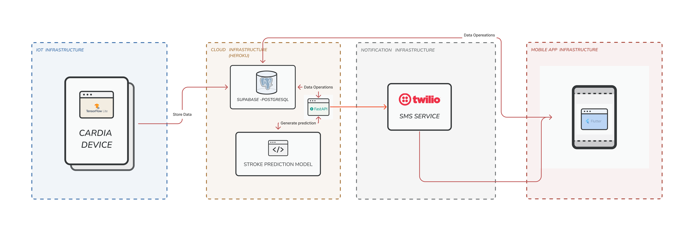

# SpectreOra

This project is an IoT-based ECG prediction application that uses a Raspberry Pi Pico connected to an AD8232 sensor to send ECG data to the cloud. A pre-trained machine learning model hosted on Heroku predicts the results, and a FastAPI RESTful API writes the predictions back to the database. A Flutter mobile app fetches the predictions and displays them to the end users.

## Architecture

1. **IoT Device >> Database (Supabase)**: The IoT device sends ECG data to the Supabase database using HTTP requests through C++ or Micropython.
2. **Database (Supabase) >> FastAPI RESTful API:**: The FastAPI RESTful API retrieves the ECG data from the Supabase database using SQL queries or Supabase SDK. The API passes the data to the pre-trained machine learning model hosted on Heroku, typically using JSON format.
3. **Pre-trained Machine Learning Model on Heroku >> FastAPI RESTful API:**:The machine learning model processes the ECG data and generates prediction results. The results are sent back to the FastAPI RESTful API in JSON format.
4. **Database (Supabase) >> Flutter Mobile App:**: The FastAPI RESTful API writes the prediction results back to the Supabase database for storage.
5. **Flutter Mobile App**: The Flutter mobile app listens to the Supabase database using Supabase subscriptions to receive prediction results in real-time. When new results are added to the database, the app automatically updates its display to show the latest predictions.

## Setup and Installation

### IoT Device

1. Set up the Raspberry Pi Pico with Micropython firmware.
2. Connect the AD8232 sensor to the Raspberry Pi Pico following the manufacturer's guidelines.
3. Write a Micropython script to read ECG data from the AD8232 sensor and send it to the chosen database using HTTP requests.

### Database

1. Set up a Firebase Realtime or Supabase database.
2. Configure the appropriate access rules and API keys for secure data transmission.

### Machine Learning Model

1. Train and export the ECG prediction machine learning model.
2. Host the pre-trained model on Heroku.

### FastAPI RESTful API

1. Create a FastAPI app with endpoints to fetch ECG data from the database, make predictions using the pre-trained model, and write predictions back to the database.
2. Deploy the FastAPI app on Heroku or another hosting platform.

### Flutter Mobile App

1. Develop a Flutter mobile app to fetch and display the prediction results from the database.
2. Configure the app to use the appropriate API endpoints and database access keys.

## Usage

1. Power on the IoT device (Raspberry Pi Pico + AD8232 sensor) and ensure it's connected to the internet.
2. The IoT device will send ECG data to the chosen database.
3. The FastAPI RESTful API will read the ECG data, make predictions using the pre-trained machine learning model, and write the predictions back to the database.
4. The Flutter mobile app will fetch and display the prediction results to the end users.

## License

This project is licensed under the [MIT License](LICENSE).
